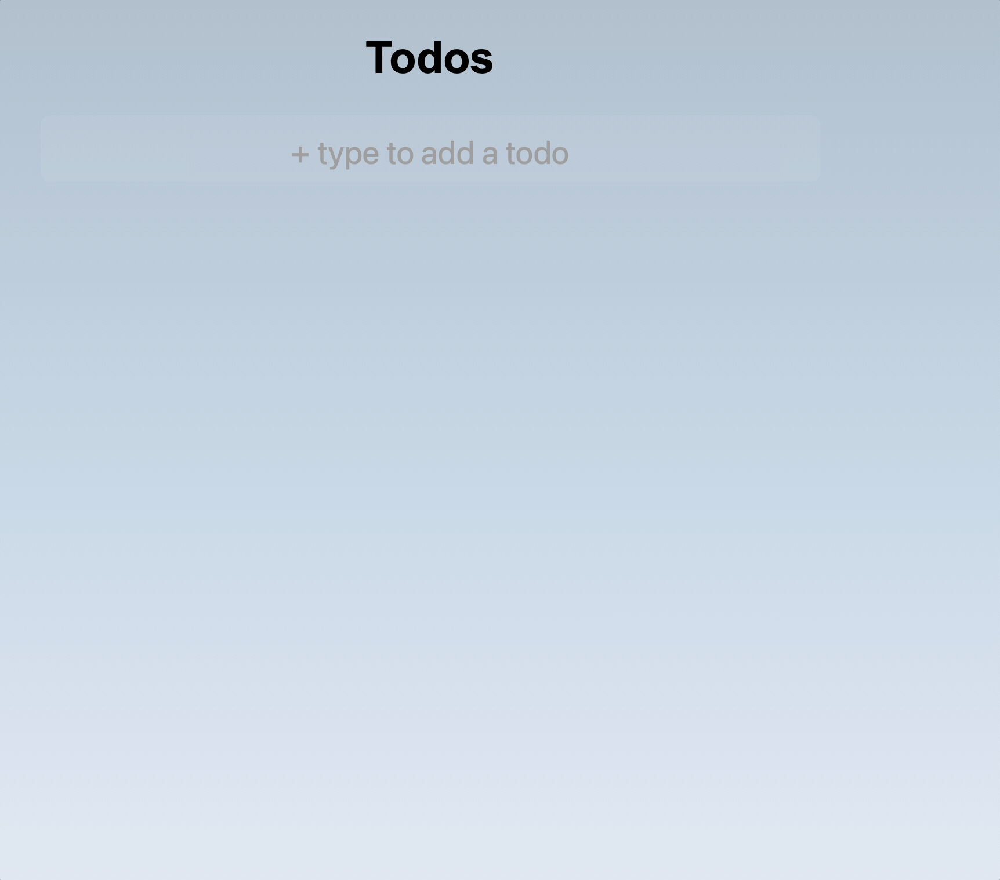

# Todo App
- Full stack Todo App created with Svelte, Typescript, Postgres and deployed using Railway and Vercel. 
- Created with the help of this [tutorial](https://www.youtube.com/watch?v=OUzaUJ3gEug&t=16896s)
- [Deployed App](https://full-stack-web-app-psi.vercel.app)

Add, Delete, Mark as done, or Update a Todo item

